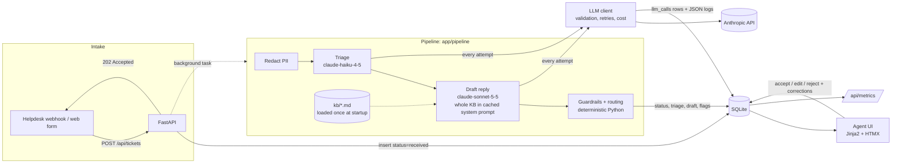
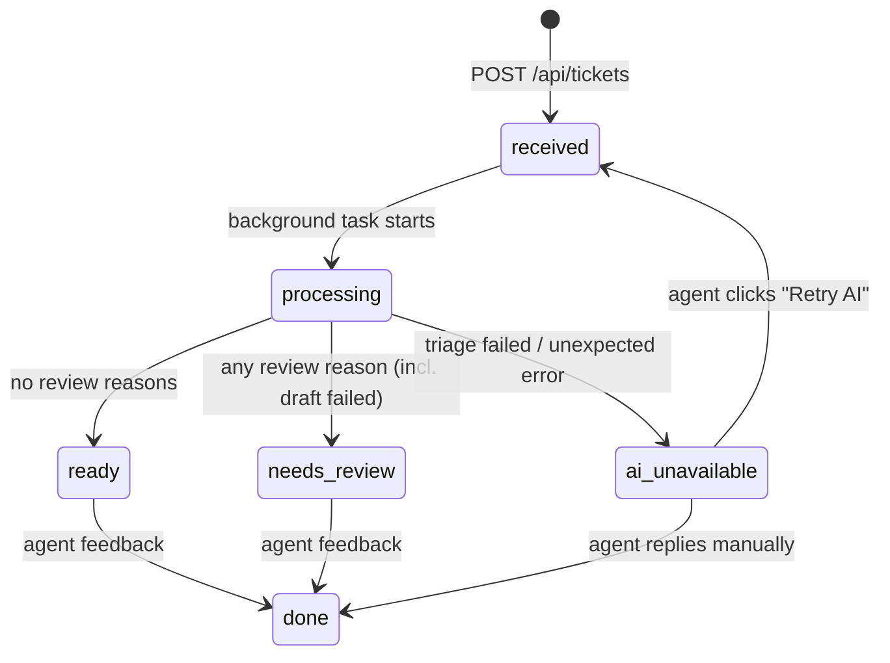
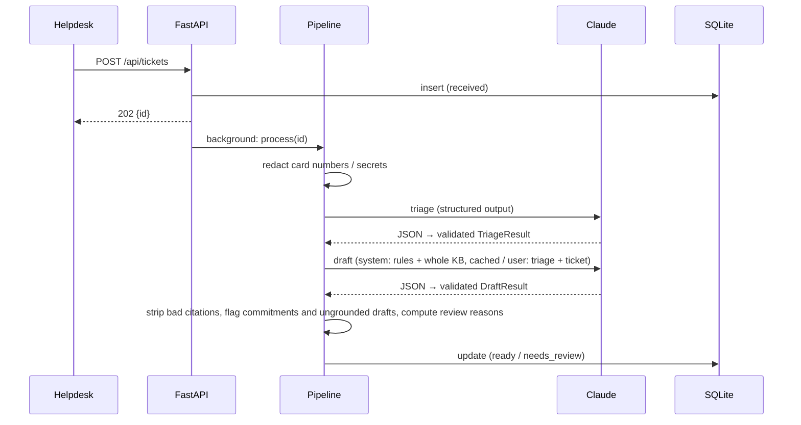

# Design note

## Architecture

## Ticket lifecycle

## Request sequence (happy path)

## Decisions log

| # | Decision | Why | Alternative considered |
|---|---|---|---|
| 1 | **Two models:** Haiku for triage, Sonnet for drafting | Triage is high-volume, short classification work where latency matters. Drafting is customer-facing writing where quality matters more. Each step uses the cheapest model that is good enough, and that is checked with `run_eval.py`, not assumed. | One model for both, which is simpler and gives one cache namespace. Easy to switch via env. |
| 2 | **Structured outputs plus local Pydantic validation,** retried once | The API guarantees JSON shape, but not constraints like `0 ≤ confidence ≤ 1`. Local validation catches the rest, and one retry fixes most sampling glitches without doubling cost on every call. | Free-text parsing (brittle). Tool use (same guarantees, more ceremony). |
| 3 | **Routing and guardrails in code, not in the prompt** | They must be deterministic, testable and auditable, and a ticket must not be able to talk its way out of review. The model provides signals; code makes the decision. | Asking the model "should a human review this?" Unpredictable, and open to prompt injection. |
| 4 | **Whole KB in the cached draft prompt,** with BM25 as an automatic fallback | Assumed KB size is under ~100 articles (13 here, ~3.5k tokens). Claude reads all of it in one call, so there's no retrieval step that can miss. Prompt caching makes it *cheaper* than retrieval ($0.0068 vs $0.0076 per ticket, measured). In the eval it never missed the right article (BM25: 94%). Its cost is over-citing (73% vs 84% citation precision). Started as BM25; manual testing showed keyword matching attaching unrelated articles to an off-topic ticket. | **BM25:** kept for KBs over `FULL_CONTEXT_MAX_TOKENS`. **Agent with search/read tools:** for 13 articles it would just read everything, at 2–5× the latency and with non-deterministic paths. Worth it for a large KB, or above all for **customer-data tools** (account status, invoices, status page), which no static KB can replace. **Embeddings:** hybrid search once the KB outgrows full context. |
| 5 | **Background task after a 202** | Intake never waits on the model (2–8 s). The UI polls. Same shape as a webhook integration. | A synchronous call (simpler, but the helpdesk webhook would time out), or a real queue (next step for scale). |
| 6 | **Partial degradation** | If drafting fails, the triage still sorts the queue. If triage fails, the ticket is handled manually as before. The AI never blocks the workflow. | All-or-nothing, which loses useful triage whenever drafting fails. |
| 7 | **Recall over precision in routing** | A missed P1 or legal threat costs far more than an agent glancing at an extra ticket. | Fewer review flags, at the price of more risk. |
| 8 | **The model sees redacted text; the agent sees the original** | Card numbers and passwords should not go to a third-party API, but the agent may need the context. | Redacting at storage, which loses information the agent needs. |
| 9 | **Server-rendered UI (Jinja2 + HTMX)** | One process, no JS build, enough for a realistic agent workflow. | A React SPA, which costs more setup time for no evaluation benefit here. |
| 10 | **Metrics computed from the DB** | Survives restarts, single source of truth, no extra infrastructure. | Prometheus/OpenTelemetry counters, the right choice for production. |
| 11 | **Concurrency cap and circuit breaker in the LLM client** | A burst of tickets must not exceed the org's concurrency limit (found as 429s when seeding), and an outage must not hold every worker thread through timeouts and retries. Tickets fail fast into `ai_unavailable` and agents work them manually. | A durable queue with backoff and a dead-letter queue, the scaling path once there are several processes (both limits are per process today). |

## Prompt design notes
- **Static system prompts.** They contain no per-request data, so they stay byte-identical and are
  cache-eligible. The draft system prompt (rules + KB sorted by article ID) is built once per process,
  and a test enforces that it doesn't depend on article order. Ticket text always goes in the user turn
  inside `<ticket>` tags and is described as untrusted.
- **The KB version is a content hash,** logged with every pipeline run next to `PROMPT_VERSION`, so a
  quality change can be traced to a KB edit as well as to a prompt edit.
- **Triage reports `prompt_injection` as a risk signal** instead of silently ignoring it, so injected
  tickets become visible to agents.
- **Instructions are duplicated deliberately.** The draft prompt forbids promising refunds or dates, and
  `guardrails.detect_commitments` checks it anyway. The prompt reduces how often it happens; the code
  catches it when it does.
- **`PROMPT_VERSION` is logged on every LLM call,** so a change in accuracy or acceptance can be traced
  back to a prompt change.
